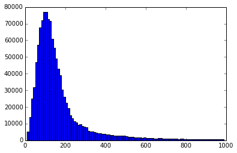
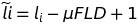
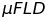

# Transcript Level Quantification

## Table of Contents

* [Introduction](#introduction)
* [Available Tools](#available-tools)
  * [Cufflinks](#cufflinks)
  * [RSEM](#rsem)
  * [eXpress](#express)
  * [Sailfish](#sailfish)
  * [Salmon](#salmon)
  * [Kallisto](#kallisto)
* [Recommended Tool](#recommended-tool)
* [How To Use](#how-to-use)

## Introduction

Much current RNA-Seq analysis essentially attempts to replicate the function of
3' expression microarrays such as AffyMetrix GeneChips or Illumina BeadArrays. Distilling the complexity of gene expression down to single observations for each gene, and summary statistics to determine which of these genes is differentially expressed. The primary problem with this kind of analysis is that it is not immediately reflective of biology. It is easy to envisage the case where a gene, which is not differentially expressed, is composed of one or more transcripts which are (see figure 1 for an example of this phenomenon from a real data set). Other confounding factors can occur, and indeed do so frequently.

![Figure 1][fig1]
**Figure 1** - a demonstration of 'isoform switching' from an RNA-Seq experiment. The gene (RERE) is not differentially expressed, but is clearly composed of two major isoforms which are.

The complexity of the information available in even a small RNA-Seq dataset allows us to go far beyond this standard analysis. Examining individual exons for expression and dysregulation is one way of working with this complexity - and there are [recommended tools and workflows for this type of analysis][exon] on this site. However, since most RNA-Seq experiments are designed to have fragments larger than the average exon,* we have the flexibility to do more than simply quantify exons. It is also possible to determine how the exons are joined to form cogent transcripts, and these transcripts can then be assessed for *their* differential expression. This is a biologically more meaningful analysis scenario.

It should be noted that despite the feasibility of this analysis approach with current RNA-Seq data, transcript-level quantification remains an extremely challenging problem, and one which many tools have attempted to address. It is only with vey recent developments that it seems like we are getting close to an optimal solution for this problem.

\* Fragment size is usually 250 bases, the average human exon is 248.08 bases, the median is 129 bases - determined from Ensembl release 79 genes, see figure 2.

![Figure 2][fig2]
<!--<div style="text-align:center"></div>-->


**Figure 2** - distribution of human exon sizes from GRCh38 (Ensembl release 79).

### Available Tools

### Cufflinks

Cufflinks is the sample quantification of the Tuxedo pipeline and has been in use since September 2009. The tools reads alignments (bam), quantifies and assembles transcripts. It's most notable for its _novel discovery_ functionality. Cufflink's novel transcript assembly approach is known as a [RABT - _reference annotation based transcript assembly_][rabt_assembly], which assembles transcripts based on read alignment.
___
Current Version 2.2.1  
[Link to Cufflinks Website][cufflinks_site]  
[Link to cufflinks paper][cufflinks]
___


### RSEM

RSEM is a versatile software package build in C++, Perl, and R. It covers quantification, simulation, differential expression (using [EBSeq][ebseq]), and data visualisation. RSEM quantification is achieved through a _de novo_ approach, which utilises ambiguously-mapped reads. RSEM quantification does not rely on the existence of a reference genome.
___
Current Version 1.2.21  
[Link to RSEM Website][rsem_site]  
[Link to RSEM paper][rsem]
___


### eXpress

eXpress was developed at Berkely and offers a streaming solution, with a low computation and memory footprint, to quantify the transcriptome. eXpress is a multi-platform tool written in C++, and like RSEM, doesn't require a reference genome. eXpress can stream alignments from popular aligners, both reference based and _de novo_.
___
Current Version 1.5.1  
[Link to eXpress Website][express_site]  
[Link to eXpress paper][express]
___


### Sailfish

Sailfish was the pioneer of the K-mer based quantification approaches, which are at the forefront of RNA-seq quantification currently. These approaches don't require alignment, and achieve transcript level quantification from raw reads. Sailfish development has been discontinued as more development is invested in its successor, Salmon.
___
Current Version beta 0.6.3  
[Link to Sailfish Website][sailfish_site]  
[Link to Sailfish paper][sailfish]
___


### Salmon

Salmon is the successor to Sailfish, developed by Rob Patro, a non-deterministic implementation to the K-mer based, alignment free transcript quantification concept. Salmon, along with Kallisto, are being developed at a very fast rate, with new releases on an almost weekly basis. While Salmon is alignment free in the traditional sense, it's algorithm makes use of _lightweight alignments_, which are very fast to compute.
___
Current Version beta 0.4.2  
[Link to Salmon Website][salmon_site]  
[Link to Salmon paper][salmon]
___


### Kallisto

Kallisto is another implementation of the popular K-mer based, alignment free transcript quantification concept. Kallisto is a deterministic algorithm that is in rapid development from Lior Prachter's lab. Kallisto works on the idea of _pseudoalignments_, similar to the _lightweight alignments_ seen in Salmon. The software can accurately quantify 30 Million human reads in around 3 minutes on a desktop.
___
Current Version beta 0.42.1  
[Link to Kallisto Website][kallisto_site]  
[Link to Kallisto paper][kallisto]
___


## Recommended tool

**Salmon or Kallisto**

At the time of writing, we are not in a position to recommned the "one best tool" for transcript-level quantification for RNA-Seq analysis. However, some clear patterns in best practice for this class of analysis are becoming clear.

Older tools, which require alignment to a genome or transcriptome have some significant limitations which inhibit their day-to-day use. Because of the alignment requirement, they are significantly slower than more modern, "alignment-free" approaches. While speed is not the only metric that counts (and often not a good metric), it does lend these tools a significant overhead which can be avoided. The [Kallisto preprint][kallisto] points to some accuracy limitations with both Cufflinks and Sailfish - the former possibly due to some limitation of the EM algorithm in dealing with multi-mapping reads, the latter likely due to information loss in K-mer generation from reads. The suggestion is that the lightweight alignment approach, taken by both Kallisto and Salmon offers both the speed advantage of the alignment-free approach pioneered by Sailfish, but with none of the accuracy loss implicit in the K-mer shredding approach.

In trying to determine whether Salmon or Kallisto is more accurate, we've simulated RNA-Seq reads with a known count distribution, and benchmarked both tools against this ground truth. The results are detailed in [this blog post][simon-blog], and are not entirely conclusive. The initial pass suggested that Kallisto is the more accurate tool, but in response to the commentary posted on the article, some modifications to the handling of Salmon results gave rise to a comparison that is probably 'too close to call'. Both tools are in rapid, active development, and this comparison work will be continued.

Each tool has some features which may be considered advantageous, and at this point, which tool to use falls to a personal preference.

Salmon has - gene level quantification, bias correction

Kallisto has - bootstrapping, deterministic


#### An aside

Salmon no longer produces FPKMs in its table of results. This is in large part due to the inconsistencies of [RF]PKM among samples (see [Wagner *et al*][wagner] for more details). Instead Transcripts Per Million (TPM) is favoured as a 'normalised' measure of transcript expression. If you want to know more about the differences between FPKM and TPM, and why the latter is preferred, see this post by Harold Pimentel: [What the FPKM?][tpm]

#### A Further aside

The way Salmon and Kallisto calculate TPM varies slightly - Salmon uses the transcript length as determined by the reference database, whereas Kallisto uses the 'effective length' of the transcript, which as the link above details:

> is usually computed as:
>
> 
>
>Where  is the mean of the fragment length distribution which was learned from the aligned read.

## How to use

### Salmon
Salmon requires you to build an index of the transcriptome sequence, for your organism of choice. Building the Salmon Index is a one off command, subsequent to that, it can be referenced in the quantification step.

#### Build an Index
| Switch | Function                   |
|:------:|:-------------------------- |
| -t     |Transcripts Fasta File|
| -i     |Output Directory|

```bash
#!/bin/bash
salmon index \
            -t /data/hg19_transcripts.fa \
            -i /data/hg19_Salmon_idx
```

#### Quantify
This example command would quantify at the gene and transcript level.

| Switch | Function                   |
|:------:|:-------------------------- |
| -g     |Gene ID to Transcript ID map|
| -p     |Number of threads|
| -i     |The Salmon Index|
| -l     |Library Type (Inward, unstranded in this case)|
| -1     |Forward reads|
| -2     |Reverse Reads|
| -o     | Output Directory|

```bash
#!/bin/bash
salmon quant \
			      -g /data/hg19_gene_map.txt \
			      -p 2 \
			      -i /data/hg19_Salmon_idx \
			      -l 'IU' \
			      -1 <(gunzip -c ~/raw_data/sample_1_Forward.fq.gz) \
			      -2 <(gunzip -c ~/raw_data/sample_1_Reverse.fq.gz) \
			      -o ~/Salmon_Output
```

Note, we're using `bash` process substitution here to deal with gzipped FASTQ files - gunzipped files can be read by Salmon natively.

### Kallisto
As with Salmon, Kallisto also requires an one off index creating, prior to quantification.

#### Build an Index
| Switch | Function                   |
|:------:|:-------------------------- |
| -i     |Transcripts Fasta File|

```bash
#!/bin/bash
kallisto index \
              -i /data/hg19_kallisto_idx \
              /data/hg19_transcripts.fa
```

#### Quantify
This example command would quantify at the transcript level

| Switch | Function                   |
|:------:|:-------------------------- |
| -i     |Kallisto Index|
| -o     |Output Directory|

```bash
#!/bin/bash
kallisto quant \
              -i /data/hg19_kallisto_idx \
              -o ~/Kallisto_output \
              ~/raw_data/sample_1_Forward.fq \
              ~/raw_data/sample_1_Reverse.fq
```


 [tpm]: https://haroldpimentel.wordpress.com/2014/05/08/what-the-fpkm-a-review-rna-seq-expression-units/
 [cufflinks]: http://www.nature.com/nbt/journal/v31/n1/full/nbt.2450.html
 [rsem]: http://www.biomedcentral.com/1471-2105/12/323/abstract
 [express]: http://www.nature.com/nmeth/journal/v10/n1/full/nmeth.2251.html
 [sailfish]: http://www.nature.com/nbt/journal/v32/n5/full/nbt.2862.html
 [salmon]: http://thereisntone.com/
 [kallisto]: http://arxiv.org/abs/1505.02710
 [exon]: ../exon-level
 [fig1]: figure-1.png
 [fig2]: figure-2.png
 [rabt_assembly]:http://bioinformatics.oxfordjournals.org/content/27/17/2325.full
 [cufflinks_site]:http://cole-trapnell-lab.github.io/cufflinks/
 [rsem_site]:http://deweylab.biostat.wisc.edu/rsem/
 [ebseq]:http://bioinformatics.oxfordjournals.org/content/29/8/1035.full
 [express_site]:http://bio.math.berkeley.edu/eXpress/
 [sailfish_site]:http://www.cs.cmu.edu/~ckingsf/software/sailfish/index.html
 [salmon_site]:https://github.com/COMBINE-lab/salmon
 [kallisto_site]:https://github.com/pachterlab/kallisto
 [simon-blog]:http://sjcockell.me/2015/05/18/alignment-free-transcriptome-quantification/
 [wagner]:http://lynchlab.uchicago.edu/publications/Wagner,%20Kin,%20and%20Lynch%20(2012).pdf
